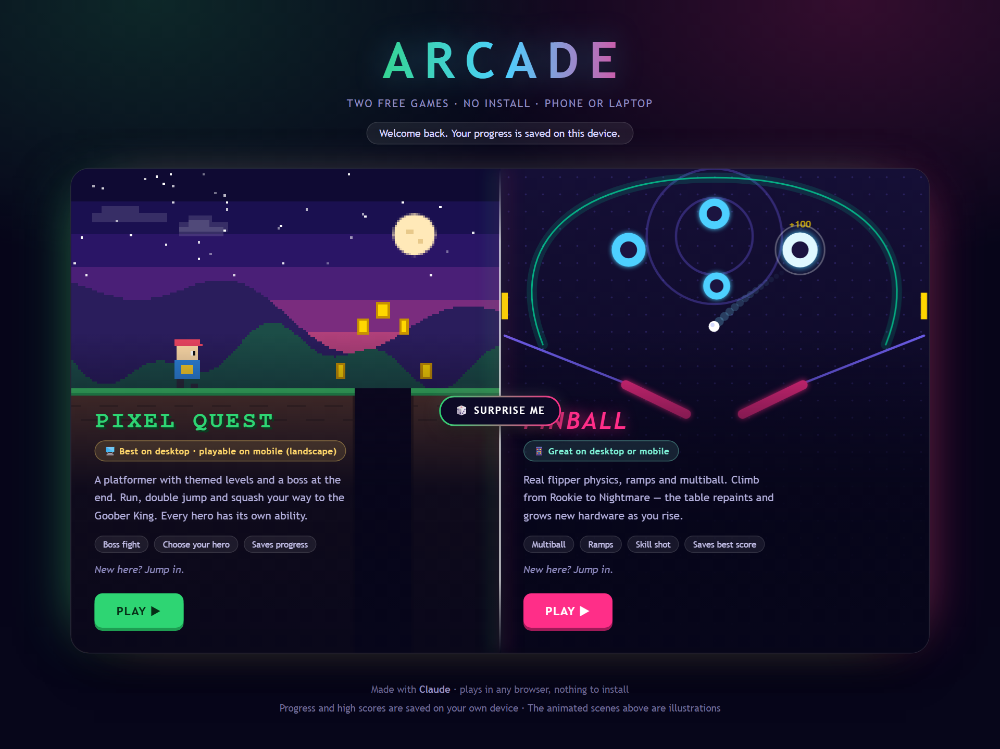

# Pixel Quest & Pinball

Two free browser games, built entirely through conversation with Claude.

**Play: [games-pinballquest.netlify.app](https://games-pinballquest.netlify.app/)**

*Screenshot of the landing page, where players pick a game or press Surprise Me.*

## The games

- **Pixel Quest** is a retro platformer with seven themed levels and a final boss. Pick from six heroes, each with its own ability, and hunt for stars, power-ups and hidden secrets.
- **Pinball** is classic arcade pinball with realistic flippers, ramps and multiball. Climb from Rookie to Nightmare as the table repaints itself and grows new bumpers and spinners. It has five themed tables, daily missions and a coin shop.

## Why it's different

- **No login.** No accounts, sign-ups or passwords.
- **No install.** Opens in any modern browser on phone, tablet or laptop.
- **Safe and private.** No ads, trackers or analytics, and no data leaves your device. Progress and high scores are stored only in your own browser.
- **Free.** Nothing to buy. The in-game shop takes only coins earned by playing.
- **Works offline.** Once a page has loaded, no connection is needed.
- **Mobile-ready.** On-screen touch controls and fullscreen mode in both games. Pixel Quest supports multi-touch, so you can move and jump at the same time.

## How it was built

- **Made with Claude.** Every line of code was written by [Claude](https://claude.ai) through plain-language conversation: describe a feature, play it, give feedback, repeat.
- **One file per game.** Each game is a single self-contained HTML file, with no frameworks, libraries or external assets. Graphics are drawn in code; sound and music are generated in the browser.
- **Hosted on Netlify** as a static site, with no server or database behind it.
- **Automatically tested.** A Playwright suite in `tests/` loads every page at desktop and phone sizes and checks for broken layouts, unreachable buttons, crashes and faulty touch controls.

## Repo contents

| File | Purpose |
|---|---|
| `index.html` | Landing page |
| `platformer.html` | Pixel Quest |
| `pinball.html` | Pinball |
| `tests/` | Automated browser checks |
| `docs/` | README screenshot |

To play locally, download the repo and open `index.html`. To run the checks, run `npm install` and `npm run check` inside `tests/` (requires Node.js).
